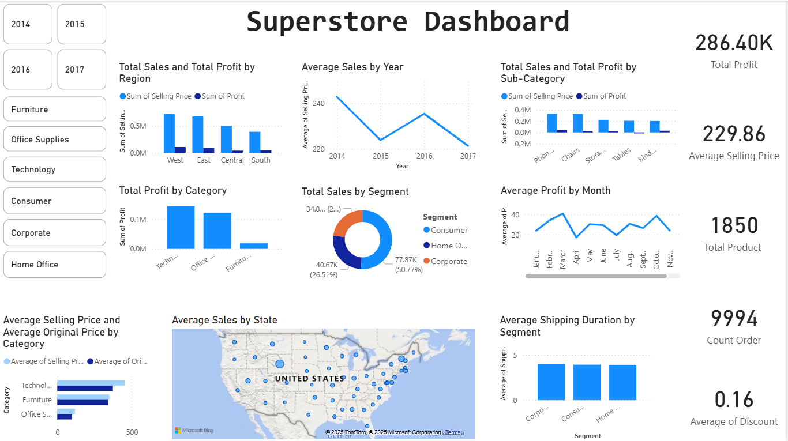

# 📊 Superstore Sales Analysis

This project provides a comprehensive **data analysis and interactive visualization** of the popular **Superstore dataset**. It includes data cleaning, exploration using Python, and dynamic dashboards with Power BI to extract actionable business insights.

> **🎯 Objective:** Analyze sales, profit, discount patterns, and regional performance to support better decision-making.

---

## 📁 Repository Structure

```
├── Superstore.csv                   # Raw dataset
├── After_analysis_Superstore.csv    # Cleaned dataset after preprocessing
├── data_cleaning&analysis.ipynb     # Jupyter Notebook for data cleaning and analysis
├── Superstore Dashboard.pbix        # Power BI file for visualization dashboard
├── Dashboard.png                    # Power BI Dashboard image preview
└── README.md                        # Project documentation
```

---

## 🚀 Features

- 🧹 **Data Cleaning:** Removed duplicates, handled missing values, and corrected data types.
- 📊 **Data Analysis:** Explored sales trends, profit margins, discounts, and segment-wise performance.
- 📈 **Interactive Dashboard:** Built in Power BI to drill down by year, region, category, and customer segment.
- 📝 **Prepared Dataset:** Clean dataset ready for advanced analytics or reporting.

---

## 🔧 Tools & Technologies

- **Python (Pandas, Matplotlib, Seaborn)** – Data preprocessing and EDA.
- **Power BI** – Dashboard and data storytelling.
- **Jupyter Notebook** – Data exploration and documentation.
- **CSV Files** – Data storage and output.

---

## 📷 Dashboard Preview



The Power BI dashboard includes:

- **Total Sales & Profit by Region**
- **Sales Trends by Year**
- **Sales & Profit by Sub-Category**
- **Profit by Product Category**
- **Sales by Customer Segment**
- **Average Monthly Profit**
- **Average Selling Price vs Original Price by Category**
- **Geographic Sales Distribution (US States)**
- **Average Shipping Duration by Segment**
- **KPIs:** Total Profit, Average Selling Price, Total Products, Order Count, Average Discount

---

## 📂 How to Run

1. Clone the repository:
   ```bash
   git clone https://github.com/your-username/superstore-sales-analysis.git
   cd superstore-sales-analysis
   ```
2. Open Jupyter Notebook and run:
   ```bash
   jupyter notebook data_cleaning&analysis.ipynb
   ```
3. Open `Superstore Dashboard.pbix` in **Power BI Desktop** to explore the dashboard.

---

## 📝 Dataset Overview

- **Source:** [Sample Superstore Dataset](https://www.kaggle.com/datasets)
- **Fields:** Order ID, Product, Category, Sales, Quantity, Profit, Region, Segment, Discount, Shipping Duration

---

## 💡 Key Insights

- **Technology** and **Office Supplies** dominate profit margins.
- **Corporate** segment contributes ~50% of total sales.
- High discounting in **Western regions** reduces profits.
- Most orders and profits come from **California** and **New York**.
- Average discount across all orders is ~16%.

---

## 👤 Author

- **Name:** Marmik  
- **Role:** Data Analyst Intern  
- **GitHub:** [your-github-profile](https://github.com/your-username)  
- **LinkedIn:** [your-linkedin-profile](https://linkedin.com/in/your-profile)

---

## 📄 License

This project is licensed under the [MIT License](LICENSE).
